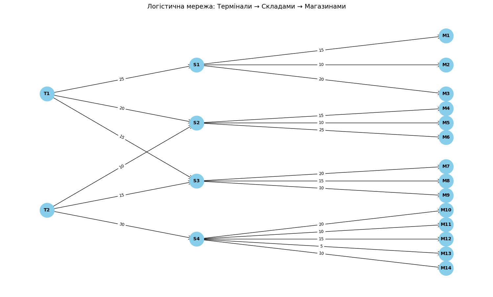

# Задача 1.
## Результати:

Максимальний потік: 115

| Термінал | Магазин | Фактичний Потік (одиниць) |
|----------|---------|---------------------------|
| T1       | M1      | 15                        |
| T1       | M2      | 10                        |
| T1       | M4      | 10                        |
| T1       | M5      | 7                         |
| T1       | M6      | 3                         |
| T1       | M7      | 10                        |
| T1       | M8      | 5                         |
| T2       | M10     | 20                        |
| T2       | M11     | 10                        |
| T2       | M4      | 5                         |
| T2       | M5      | 3                         |
| T2       | M6      | 2                         |
| T2       | M7      | 10                        |
| T2       | M8      | 5                         |

| Термінал | Фактичний Потік (одиниць) |
|----------|---------------------------|
| T1       | 60                        |
| T2       | 55                        |

# Відповіді на питання:

## 1) Які термінали забезпечують найбільший потік товарів до магазинів?
Термінал **T1** забезпечує найбільший потік товарів до магазинів. 

## 2) Які маршрути мають найменшу пропускну здатність і як це впливає на загальний потік?
Найменші пропускні здатності:  
- Тонке місце — **T2 -> S2**.  
Це обмежує можливість **T2** постачати товари до **M4 - M6**, які отримали невеликий потік.

## 3) Які магазини отримали найменше товарів і чи можна збільшити їх постачання, збільшивши пропускну здатність певних маршрутів?
- Магазини, які не отримали жодного товару:  
  **M3, M9, M12, M13, M14**  
- Магазини, які отримали мало:  
M6 – лише 5 одиниць (T1=3, T2=2)  
M5 – 10 одиниць (T1=7, T2=3)  
M4 – 15 одиниць (T1=10, T2=5)  
- Чи можна збільшити?  
M3, M9 — отримують товари через S1, S3 відповідно. Якщо збільшити ємність T1→S1 або T2→S3, це потенційно дозволить направити більше товарів.  
M13, M14 — йдуть через S4, а вона отримує товари лише від T2, який уже завантажений.  
M12 (через S4) — також не отримала нічого, бо потоки розподілились по інших гілках.  
- Потрідбно зробити  
Збільшити пропускну здатність на шляху T2 → S4 або далі S4 → M13–M14–M12.  
Зменшити завантаженість складу S4, або краще розподілити потік з T2.  

## 4) Чи є вузькі місця, які можна усунути для покращення ефективності логістичної мережі?  
Так. Основні вузькі місця:  
T2 → S2 (10) — обмежує потік до S2, що постачає M4–M6.  
S4 → M13 (5) — дуже обмежене постачання, хоча S4 має достатній вхідний потік.  
S4 → M12/M14 — хоч і більші за ємністю, але все одно не отримали потоку.  
Як покращити ефективність:  
- Збільшити пропускну здатність на T2 → S2 і S4 
- Зменшити перевантаження на S3, т.я. має лише 15/15 вхідної ємності з T1 і T2.
- Розглянути балансування. Можливо, варто змінити деякі маршрути або додати нові шляхи з T1 до S4, щоб зменшити навантаження на T2.
